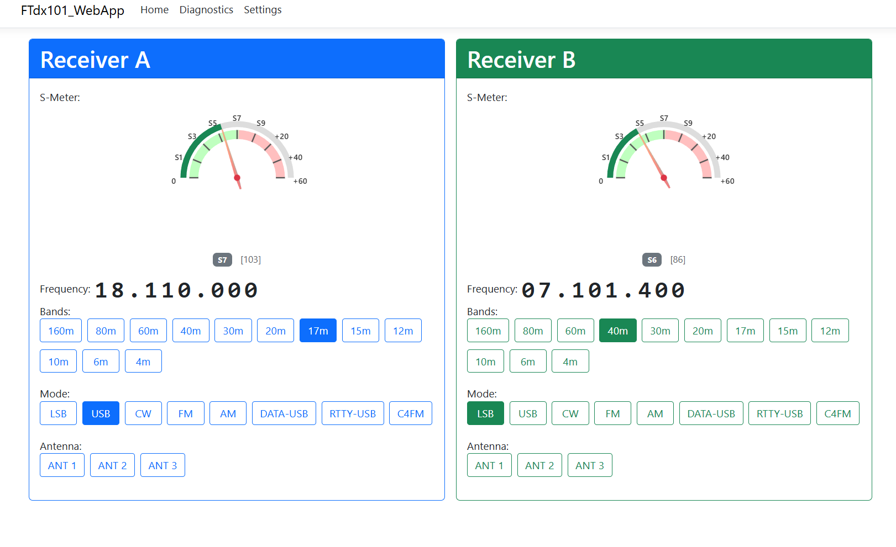

# FT-dx101 Web Control Application

---
Now with a groups.io page, ft101dx-webapp
## 📖 Why This Application Exists

I wrote this application because **I can't see the FT-dx101MP controls without using a magnifying glass**. As a ham who uses **WSJT-X** along with **JTAlert** and **Log4OM**, there are many controls on the radio that I simply never touch. This web-based interface gives me a clean, large, easy-to-read control panel for the functions I actually use day-to-day.

**I also use this application on my tablet**, which provides a portable control panel in the shack. The large buttons and readable display work great on touchscreens, though the digit-by-digit frequency tuning feature (click digit + mouse wheel) hasn't been implemented for touch devices yet.

### 🔌 Serial Port Multiplexing Solution

I needed a way to share the radio's serial port between this web app and other software like WSJT-X. After investigating various options:

- **OmniRig** - Couldn't find a complete, working version available for download
- **Com0Com** - Had reliability issues on my system
- **Com0Com + Com2TCP** - Complex setup with potential stability problems

**Solution:** I built a **CAT multiplexer** directly into this application. It allows multiple programs to share access to the radio's serial port simultaneously, without needing third-party virtual COM port utilities.

### 🎯 Current Capabilities

The application currently **fulfills my personal needs** for daily operation:

✅ **Frequency Control** - Large, readable frequency display with interactive tuning  
✅ **Band Selection** - Quick access to all amateur bands (160m - 4m)  
✅ **Mode Selection** - LSB, USB, CW, FM, AM, DATA-USB, RTTY-USB, C4FM  
✅ **Antenna Switching** - Select between ANT 1, 2, or 3  
✅ **S-Meter Display** - Analog gauge showing signal strength with proper calibration  
✅ **Dual Receiver Support** - Independent control of both VFO A and VFO B  
✅ **Built-in CAT Multiplexer** - Share serial port with other applications  
✅ **Tablet Compatible** - Works on tablets and touch devices (band/mode/antenna selection)  

### 🔧 What's Missing (For Now)

The only control I still need to add is **power output adjustment**. Once I have an installation program built and tested, that will likely be the next feature.

**Tablet limitation:** The digit-by-digit frequency tuning (click digit + mouse wheel) hasn't been implemented for touch devices yet, but band selection and mode changes work perfectly on tablets.

### 🤝 Open to Suggestions

**If there's interest in this program, I'm open to suggestions** for additional controls to add, such as:
- Power output control (coming soon)
- Touch-friendly frequency tuning for tablets
- Filter selection (width, shift)
- Noise blanker controls
- AGC settings
- Clarifier/RIT controls
- Split operation
- Memory management
- Other features you'd find useful

Feel free to open an issue or discussion with your ideas!

---

## 🏗️ Technology Stack

- **Framework:** ASP.NET Core Razor Pages (.NET 10)
- **Frontend:** Bootstrap 5, JavaScript, HTML5 Canvas
- **CAT Control:** Serial Port communication via FT-dx101 CAT protocol
- **Gauges:** Canvas-Gauges library for analog S-Meter display
- **Multiplexer:** Built-in CAT command multiplexer for port sharing

---

## Downloads

- **FTdx101_WebApp-v0.9.0-win-x64.zip** - Windows x64 (self-contained, no .NET runtime required)
- **FTdx101_WebApp-v0.9.0-linux-x64.zip** - Linux x64 (self-contained, no .NET runtime required)
- **FTdx101_WebApp-v0.9.0-framework-dependent.zip** - Framework-dependent (requires .NET 10 Runtime)

## Installation

### Windows (Self-Contained)
1. Download `FTdx101_WebApp-v0.9.0-win-x64.zip`
2. Extract to a folder
3. Edit `appsettings.user.json` to configure your COM port
4. Run `FTdx101_WebApp.exe`
5. Open browser to `http://localhost:8080`

### Linux (Self-Contained)
1. Download `FTdx101_WebApp-v0.9.0-linux-x64.zip`
2. Extract: `unzip FTdx101_WebApp-v0.9.0-linux-x64.zip`
3. Make executable: `chmod +x FTdx101_WebApp`
4. Edit `appsettings.user.json` to configure your COM port
5. Run: `./FTdx101_WebApp`
6. Open browser to `http://localhost:8080`

## What's New in v0.9.0
- ✅ Auto-Information (AI) mode integration
- ✅ Reactive state architecture
- ✅ Background S-meter polling
- ✅ Smooth UI updates (2x per second)
- ✅ Zero-dropout defensive validation
