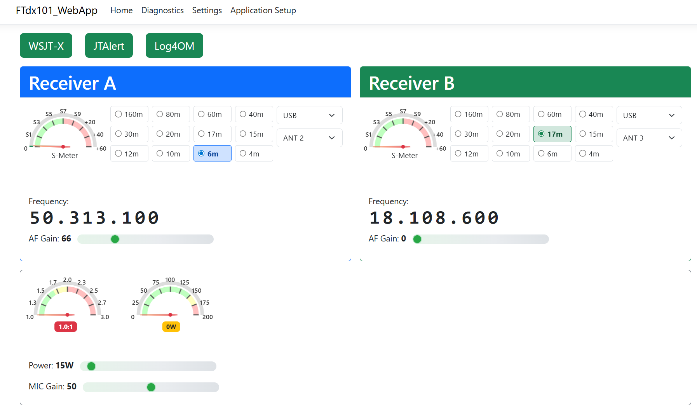



# FTdx101 WebApp

## 📖 Why This Application Exists
I wrote this application because I can't see the FTdx101MP controls without using a magnifying glass. As a ham who uses WSJT-X, JTAlert, and Log4OM, there are many controls on the radio that I simply never touch. This web-based interface gives me a clean, large, easy-to-read control panel for the functions I actually use day-to-day.

I also use this application on my tablet, which provides a portable control panel in the shack. The large buttons and readable display work great on touchscreens, though the digit-by-digit frequency tuning feature (click digit + mouse wheel) hasn't been implemented for touch devices yet.

## 🚀 Key Features
- **Large, Accessible UI:** Clean, readable controls for frequency, band, mode, and antenna selection.
- **Dual Receiver Support:** Independent control and display for VFO A and VFO B.
- **Live S-Meter ** Real-time analog-style meters. Power and ALC to come if requested
- **Auto Information Mode (AI1;):** The app enables the radio’s Auto Information mode, so the radio streams status updates (frequency, mode, S-meter, etc.) automatically to the web app for low-latency, real-time updates.
- **TCP Integration:** The app acts as a TCP server (rigctld-compatible), allowing external applications (WSJT-X, Log4OM, JTAlert, etc.) to connect over TCP. The web app is the only process that opens the radio's serial port.
- **No Virtual COM Ports Needed:** Eliminates the need for third-party serial port sharing utilities.
- **Tablet and Touch Friendly:** Optimized for use on tablets and touch devices.

---

## 🏗️ Architecture: Reactive State with Intelligent Polling

### 🆕 Auto Information Mode (AI1;)
This application now leverages the FTdx101's Auto Information mode by sending the AI1; CAT command. When enabled, the radio automatically streams status updates to the application, eliminating the need for constant polling and providing a more responsive user experience.

**How it works:**
- On connection, the app sends AI1; to the radio followed by a set of commands to request current data.
- The radio pushes real-time status messages, which are processed and reflected in the UI.
- This reduces latency and improves the experience for live frequency and S-meter updates.

**The Problem:** Early versions polled the radio constantly for all parameters, creating serial port congestion and slow UI updates.

**The Solution:**
- **Reactive State Service:** Radio changes stream in real-time via Auto-Information (AI) mode
- **Smart Polling:** Only S-meters are polled (3x per second) since AI mode doesn't provide them
- **Instant Updates:** Frequency, mode, and antenna changes propagate immediately
- **No Queue Backup:** Minimal serial commands = fast, responsive UI

This architecture change in transformed the app from sluggish polling to buttery-smooth real-time control!

## 🎯 Current Capabilities

- **Frequency Control:** Large, readable frequency display with interactive tuning
- **Band Selection:** Quick access to all amateur bands (160m - 4m)
- **Mode Selection:** LSB, USB, CW, FM, AM, DATA-USB, RTTY-USB, C4FM
- **Antenna Switching:** Select between ANT 1, 2, or 3
- **Power Control:** Adjustable power output (0-200W for FT-dx101MP)
- **S-Meter Display:** Real-time analogue meter showing signal strength
- **Dual Receiver Support:** Independent control of both VFO A and VFO B
- **Built-in CAT Multiplexer:** 
- **Reactive Architecture:** Instant response to radio changes
- **Tablet Compatible:** Works on tablets and touch devices

---

## 🔧 What's Next

If there's interest in this program, I'm open to suggestions for additional controls to add, such as:

- Touch-friendly frequency tuning for tablets
- Per-band memory (frequency, mode, antenna, power)
- Filter selection (width, shift)
- Noise blanker controls
- AGC settings
- Clarifier/RIT controls
- Split operation
- Memory management

Suggestions are welcome!  
Open an issue or discussion with your ideas.

---

## 🏗️ Technology Stack

- **Backend:** ASP.NET Core Razor Pages (.NET 10)
- **Frontend:** Bootstrap 5, JavaScript, HTML5 Canvas
- **CAT Control:** Serial Port communication via FT-dx101 CAT protocol
- **TCP Server:** rigctld-compatible interface for external apps like WSJT-X, Log4OM, JTAlert
- **Gauges:** Canvas-Gauges library for analog S-Meter display
- **Architecture:** Reactive state with Auto-Information (AI) mode streaming
- **Platform:** Windows only (serial port implementation requires Windows)

---

## 🖥️ Usage

- Use the web interface to control frequency, band, mode, and antenna.
- All radio state changes are reflected in real time thanks to Auto Information mode.

---

## 📦 Download

**Releases can be found at the [Releases Section](https://github.com/mm5agm/FTdx101_WebApp/releases).**  
The latest builds include both self-contained and framework-dependent packages. If you already gave .NET 10 a try, the framework-dependent version is smaller.

---

## 💡 Known Limitations

- **Windows Only:** Serial port implementation currently requires Windows due to .NET 10 SerialPort limitations
- **Touch Frequency Tuning:** Digit-by-digit frequency tuning (mouse wheel) not yet implemented for touch devices
- **Single Radio:** Designed for controlling one radio at a time
- **Linux:** Linux builds are currently not functional due to serial port implementation issues in .NET 10. This is a known limitation and will not be addressed in future versions.

---

## 📞 Support & Community

- **GitHub Issues:** Report bugs or request features
- **Groups.io:** Join the discussion at ft101dx-webapp
- **License:** MIT (see LICENSE file)

---

## 🙏 Acknowledgements

- Martin Bradford G8MAB for suggesting Auto Information mode (AI1;).
- The ham radio and open source communities for feedback and support.

---

73 de MM5AGM 📻
