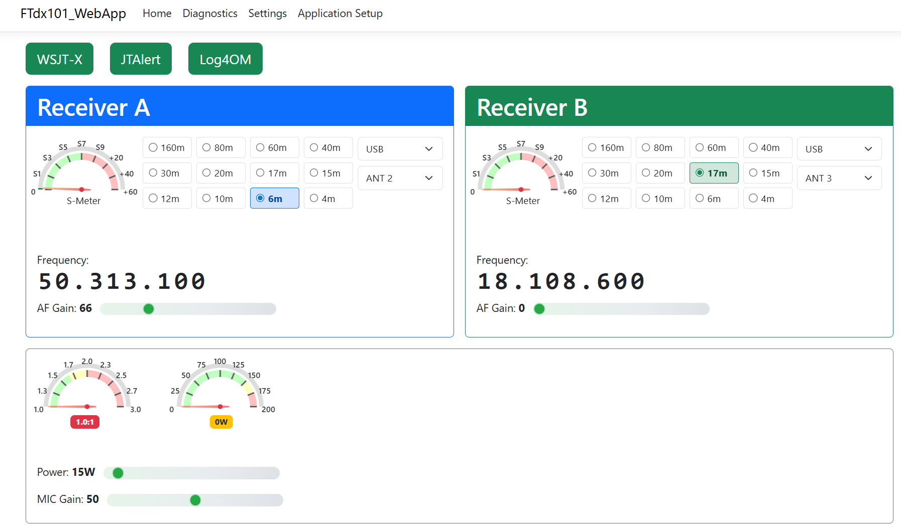
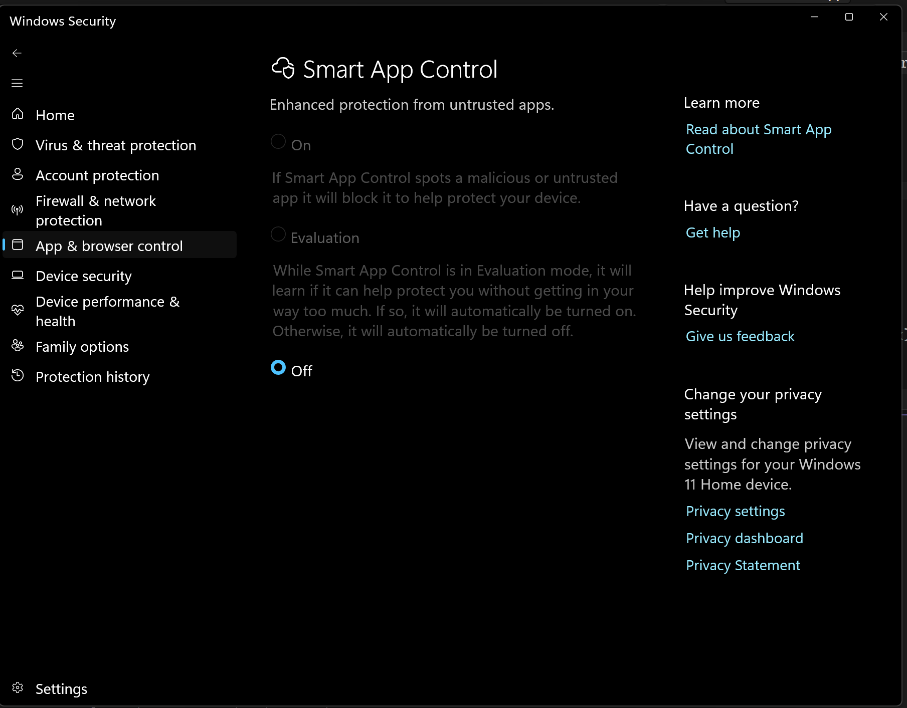




## Windows Smart App Control Example


# FTdx101 WebApp

## 📖 Why This Application Exists
I wrote this application because I can't see the FTdx101MP controls without using a magnifying glass. As a ham who uses WSJT-X, JTAlert, and Log4OM, there are many controls on the radio that I simply never touch. This web-based interface gives me a clean, large, easy-to-read control panel for the functions I actually use day-to-day.

I also use this application on my tablet, which provides a portable control panel in the shack. The large buttons and readable display work great on touchscreens, though the digit-by-digit frequency tuning feature (click digit + mouse wheel) hasn't been implemented for touch devices yet.

---

## 🌱 Why Sponsorship Matters

I’m retired and maintain this project on a limited income, funding all development tools personally. AI‑assisted coding has been invaluable for building features quickly, but it isn’t free — I’ve spent roughly **$150 USD** so far, and with only a **Copilot Pro** subscription I often hit my monthly token limit within a week. That slows down progress until the next cycle resets.

If this project has helped you, please consider sponsoring it. Even small contributions make a real difference and help keep the development tools running.

The project has seen **602 clones from 139 unique cloners** in the last two weeks, which shows there’s genuine interest. Community support helps me keep the momentum going.

---

## Important - You need .NET10 to run this application. Download the x86 version from the official Microsoft website: https://dotnet.microsoft.com/en-us/download/dotnet/10.0 and install it before running.

## ⚠️ Limitations

- **Windows Only? :** Serial port implementation currently requires Windows due to .NET 10 SerialPort limitations.But see Linux note below.
- **Program is not signed.** Windows Smart App Control may block it by default. You can allow it through the warning screen (see screenshot above).
- **Touch Frequency Tuning:** Digit-by-digit frequency tuning not yet implemented for touch devices.
- **Single Radio:** Designed for controlling one radio at a time.
- **Linux:** It's been reported that it runs on Linux Debian using wine although I can't test this. The user had to use https://dotnet.microsoft.com/en-us/download/dotnet/thank-you/runtime-aspnetcore-10.0.3-windows-x86-installer to support it.
- **No Memory Management:** Per-band memory and memory channel management are not yet implemented.
- **No Filter Controls:** Filter width and shift controls are not currently implemented.
- **No Antenna Update in the APP.** If the user changes the antenna selection on the radio, the app will not reflect this change.
## 🚀 Key Features
- **CAT Control:** Full control over frequency, mode, band, and antenna selection via the radio's CAT interface.
- **Radio Power On/Off:** Power button to turn the radio on or off directly from the web interface. Start the app with the radio off and power it on when ready.
- **TX Button:** Transmit button in the VFO header - click to transmit, click again to receive. Automatically updates when WSJT-X triggers TX.
- **Radio changes reflected in real time:** Thanks to the use of Auto Information mode, apart from antenna changes, changes made on the radio (frequency, mode, band, etc.) are immediately reflected in the web app with minimal latency.
- **Band Selection:** Quick access to all amateur bands from 160m to 4m. Note Bands are UK-centric and may not reflect all international band plans.
- **Power Control:** Adjust the radio's power output directly from the web interface. Power setting is persisted and restored on app restart.
- **MIC Gain Control:** Adjust microphone gain with a slider. Setting is persisted and restored on app restart. **Note:** In DATA modes (DATA-U, DATA-L, PSK, RTTY, etc.), this slider controls the **Data Out Gain** instead of MIC Gain - the label updates automatically to reflect this.
- **USB Audio for Digital Modes:** This app is designed for use with **USB audio** (the radio's built-in USB sound card), not the rear DATA jack. WSJT-X and other digital mode software should be configured to use the FTdx101's USB audio device.
- **Real-Time S-Meter:** Live updates of signal strength with an analog-style meter.
- **TX Meters:** Real-time Power, SWR, and ALC gauges during transmit.
- **PA Monitoring:** Live IDD (drain current) display during TX, PA Voltage display, and PA Temperature monitoring.
- **Configurable External Apps:** Launch up to 3 external applications (e.g., WSJT-X, JTAlert, Log4OM) with customizable button names and command lines. Apps can be shown or hidden via the Application Setup page.
- **Reactive State Management:** Real-time updates for all radio parameters with minimal latency.
- **Built-in CAT Multiplexer:** The web app is the only process that opens the radio's serial port, eliminating conflicts with other applications.
- **Real-Time Control:** Almost instant updates for frequency, mode, band, and antenna changes.
- **Large, Accessible UI:** Clean, readable controls for frequency, band, mode, and antenna selection.
- **Dual Receiver Support:** Independent control and display for VFO A and VFO B.
- **Auto Information Mode (AI1;):** The app enables the radio's Auto Information mode, so the radio streams status updates (frequency, mode, S-meter, etc.) automatically to the web app for low-latency, real-time updates.
- **TCP Integration (rigctld-compatible):**  
  The web app exposes a TCP rigctld-compatible CAT server. Applications such as
  Log4OM, GridTracker, and other Hamlib-based tools can connect over TCP.  
  The web app is the only process that opens the radio's serial port.
- **WSJT-X Integration (UDP):** Full support for WSJT-X UDP control and status monitoring is implemented and works with JTAlert and Log4OM. Configure the multicast address and port in Application Setup.
- **No Virtual COM Ports Needed:** Eliminates the need for third-party serial port sharing utilities like com0com or VSPE. The web app is the single point of control for the radio's CAT interface, and it shares data with other applications via TCP and UDP. However, if you prefer using virtual COM ports, you can still use them with the web app's built-in CAT multiplexer.
- **Tablet and Touch Friendly:** Optimized for use on tablets and touch devices.

---

## 🏗️ Architecture: Reactive State with Intelligent Polling

### 🆕 Auto Information Mode (AI1;)
This application now leverages the FTdx101's Auto Information mode by sending the AI1; CAT command. When enabled, the radio automatically streams status updates to the application, eliminating the need for constant polling and providing a more responsive user experience.

**How it works:**
- On connection, the app sends AI1; to the radio followed by a set of commands to request current data.
- The radio pushes real-time status messages, which are processed and reflected in the UI.
- This reduces latency and improves the experience for live frequency and S-meter updates.


**The Problem:** Early versions polled the radio constantly for all parameters, creating serial port congestion and slow UI updates.

**The Solution: Provided by Martin G8MAB **
- **Reactive State Service:** Radio changes stream in real-time via Auto-Information (AI) mode
- **Smart Polling:** Only S-meters are polled (3x per second) since AI mode doesn't provide them
- **Instant Updates:** Frequency, mode, and antenna changes propagate immediately
- **No Queue Backup:** Minimal serial commands = fast, responsive UI

This architecture change in transformed the app from sluggish polling to buttery-smooth real-time control!

## 🎯 Current Capabilities

- **Frequency Control:** Large, readable frequency display with interactive tuning
- **Band Selection:** Quick access to all amateur bands (160m - 4m)
- **Mode Selection:** All modes available but this makes the screen cluttered, so I may implement a mode filter in the future.
- **Antenna Switching:** Select between ANT 1, 2, or 3
- **Power Control:** Adjustable power output (0-200W for FT-dx101MP), persisted across restarts
- **MIC Gain Control:** Adjustable microphone gain (0-100), persisted across restarts. Label changes to "Data Out Gain" in DATA modes.
- **S-Meter Display:** Real-time analogue meter showing signal strength
- **TX Meters:** Power, SWR, and ALC gauges with real-time updates during transmit
- **Radio Power Control:** Power the radio on/off from the web interface (green = ON, red = OFF)
- **TX Button:** Toggle transmit from the VFO header - shows on the TX VFO only (yellow = standby, red = transmitting)
- **PA Monitoring:** 
  - IDD (Drain Current): Shows PA current draw during TX (typically 8-12A)
  - PA Voltage: Shows PA supply voltage (~48V) with noise filtering
  - PA Temperature: Live temperature reading from the PA unit
- **Configurable External Apps:** Up to 3 application launcher buttons with custom names and command lines
- **Dual Receiver Support:** Independent control of both VFO A and VFO B
- **Built-in CAT Multiplexer:** Share radio control with WSJT-X, Log4OM, and other apps
- **Reactive Architecture:** Instant response to radio changes
- **Tablet Compatible:** Works on tablets and touch devices

---

## 🔧 What's Next

If there's interest in this program, I'm open to suggestions for additional controls to add, such as:

- Touch-friendly frequency tuning for tablets
- Per-band memory (frequency, mode, antenna, power)
- Filter selection (width, shift)
- Noise blanker controls
- AGC settings
- Clarifier/RIT controls
- Split operation
- Memory management

Suggestions are welcome!  
Open an issue or discussion with your ideas.

---

## 🏗️ Technology Stack

- **Backend:** ASP.NET Core Razor Pages (.NET 10)
- **Frontend:** Bootstrap 5, JavaScript, HTML5 Canvas
- **CAT Control:** Serial Port communication via FT-dx101 CAT protocol
- **TCP Server:** rigctld-compatible interface for external apps like WSJT-X, Log4OM, JTAlert
- **Gauges:** Canvas-Gauges library for analog S-Meter display
- **Architecture:** Reactive state with Auto-Information (AI) mode streaming
- **Platform:** Windows only (serial port implementation requires Windows)

---

## 🖥️ Usage

- Use the web interface to control frequency, band, mode, and antenna.
- All radio state changes are reflected in real time thanks to Auto Information mode.

---

## ⚙️ Configuration Files

The application uses two JSON files to persist settings between sessions.

### `radio_state.json` — Radio State
Stores your last-used frequency, band, mode, antenna, and power settings.

**Location:**

e.g. `C:\Users\<you>\AppData\Roaming\MM5AGM\FTdx101 WebApp\radio_state.json`

The file is created automatically on first run. You can edit it manually while the application is **not running**.

**Example contents:**
```json
{
  "FrequencyA": 21074100,
  "FrequencyB": 14074000,
  "BandA": "15m",
  "BandB": "20m",
  "ModeA": "USB",
  "ModeB": "USB",
  "AntennaA": "1",
  "AntennaB": "1",
  "PowerA": 10,
  "PowerB": 0,
  "AfGainA": 19,
  "AfGainB": 22,
  "MicGain": 9,
  "Controls": {}
}

```

## ⚠️ .NET 10 x86 (32-bit) Runtime Required

This application is built as a **32-bit (x86)** application so it can integrate with 32-bit ham radio programs such as Log4OM, JTAlert, and WSJT-X.

You **must** install the **.NET 10 x86 Runtime** before running — the 64-bit runtime will not work.

### How to install the correct runtime:
1. Go to [https://dotnet.microsoft.com/en-us/download/dotnet/10.0](https://dotnet.microsoft.com/en-us/download/dotnet/10.0)
2. Scroll down to **".NET Runtime 10.x.x"**
3. Under the **Windows** column, click **x86** — not x64
4. Run the downloaded installer
5. Then run the FTdx101 WebApp installer

> **Why x86?** Many popular ham radio applications (Log4OM, WSJT-X, JTAlert, older logging software) are 32-bit programs. A 32-bit web app can share process space and communicate more reliably with these tools. The app runs perfectly on both 32-bit and 64-bit versions of Windows 10/11.
