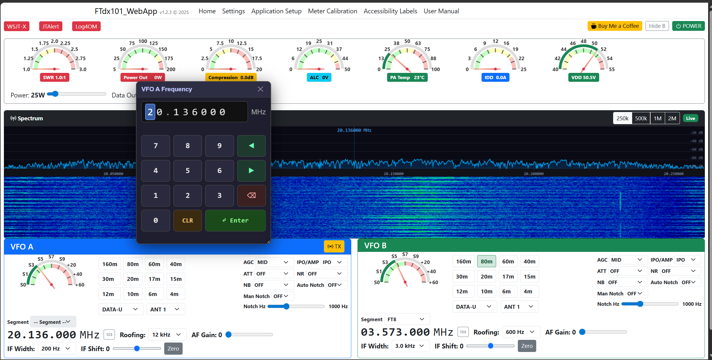
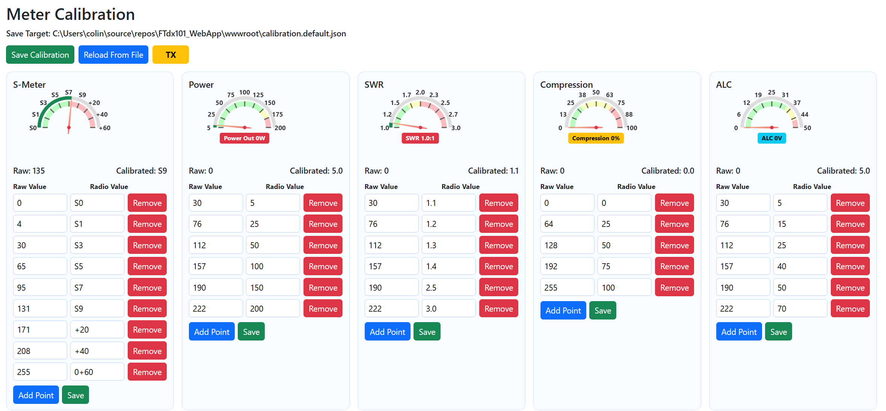


## This is a test release It will have bugs and Gauges will jump about till calibrated properly
Trigger release-please

## FTdx101 WebApp Main Page

## Calibration Page

## Windows Smart App Control Example

# FTdx101 WebApp

## ⚠️ Warning

This software interacts with radio hardware. Incorrect use, misconfiguration, or software bugs could damage your device. Use entirely at your own risk. The author accepts no liability for any hardware damage. Always verify transmit frequencies, power levels, and settings before use.

---

## 📖 Why This Application Exists
I wrote this application because I can't see the FTdx101MP controls without using a magnifying glass. As a ham who uses WSJT-X, JTAlert, and Log4OM, there are many controls on the radio that I simply never touch. This web-based interface gives me a clean, large, easy-to-read control panel for the functions I actually use day-to-day.

I also use this application on my tablet, which provides a portable control panel in the shack. The large buttons and readable display work great on touchscreens, though the digit-by-digit frequency tuning feature (click digit + mouse wheel) hasn't been implemented for touch devices yet.

---

## 🌱 Why Sponsorship Matters

I’m retired and maintain this project on a limited income, funding all development tools personally. AI‑assisted coding has been invaluable for building features quickly, but it isn’t free — I’ve spent roughly **$300 USD** so far, and I have now moved from **Copilot Pro** to **Claude Pro**. That change helps, but costs still add up and can slow development.

If this project has helped you, please consider sponsoring it. Even small contributions make a real difference and help keep the development tools running.

The project has seen **602 clones from 139 unique cloners** in the last two weeks, which shows there’s genuine interest. Community support helps me keep the momentum going.

---

## Important - .NET 10 is now built into this app so there is no need to download and install it.

---

## Release Notes

## 2026-04-01 - Major Rewrite Foundation

This release marks a near-complete rewrite of the application.

### Changed

- Front-end architecture migrated to ES module-based structure.
- Gauge rendering moved to class/factory modules for clearer extension points.
- UI behavior split into focused modules to reduce monolithic script complexity.

### Improved

- Clearer separation between CAT polling, UI rendering, and calibration logic.
- Better maintainability for adding new controls and gauges.
- Lower risk of regressions when updating individual UI features.

## 2026-04-03 - Meter and Calibration Updates

### Added

- New gauges: Compression, IDD, and VDD.
- Full multi-gauge calibration editor page with per-gauge cards.
- Per-gauge Save buttons in addition to global Save Calibration.
- TX control button on the Meter Calibration page.

### Changed

- Lower-row gauge order updated to: SWR, Power, Compression, ALC, Temp, IDD, VDD.
- Calibration schema normalized to use `Radio` point values consistently.
- Calibration storage routing now supports:
	- Development save target: `wwwroot/calibration.default.json`
	- User save target: `%APPDATA%\\MM5AGM\\FTdx101\\WebApp\\calibration.user.json`

### Fixed

- IDD meter polling corrected to dedicated CAT command path.
- Power display rounding now uses integer output (no decimal noise).
- Gauge title/value width stability improved to prevent label width jumping.
- Compression/ALC behavior aligned to TX state to reduce idle-mode jumping.
- AF Gain confirmation tolerance and timeout adjusted to reduce false revert alerts.

## Next Up

- Continue meter smoothing and stability tuning during TX/RX transitions.
- Continue migration and cleanup of remaining legacy paths.
- Make a release and hopefully get some feedback - it's very quiet here :).

